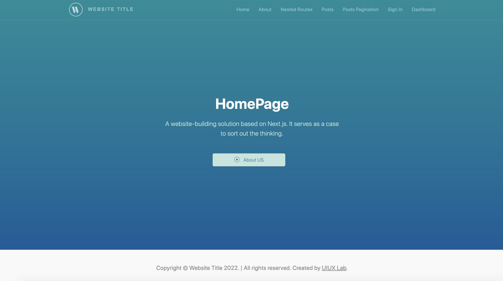

# Full-Stack Next.js Application Template

 This repository is a full-stack sample web application based on Next.js that creates a simple whole-website architecture, and provides the foundational services, components, and plumbing needed to get a basic web application up and running. 




## Table of Contents

* [Scheme](#scheme)
* [File Structures](#file-structures)
* [Getting Started](#getting-started)
* [Deploy on Custom Server](#deploy-on-custom-server)
* [Further Help](#further-help)
* [Contributing](#contributing)
* [Supported development environment](#supported-development-environment)
* [Changelog](#changelog)
* [Licensing](#licensing)


## Scheme

List my progress here:


| Function Block |  Supports  |
| --- | --- |
| Navigation | ✅ |
| Parameter Acquisition | ✅ |
| Pagination | ✅ |
| Basic Components | ✅ |
| Authorization | ✅ |
| Login | ✅ |
| Register | ✅ |
| Network Requests | ✅ |
| Routes Demo | ✅ |
| API Demo | ✅ |
| CURD Demo | ✅ |
| JWT Demo | ✅ |
| Dynamic Routes Demo | ✅ |
| File Import | ✅ |
| SEO Premium | ✅ |
| Static Pages | ✅ |
| Incremental Static Regeneration | ✅ |
| Remote Download | ✅ |
| Fully Static HTML Files Generation | ✅ |
| Custom Server | ✅ |
| Frontend Page Interacts With Node | ✅ |
| Alias Support | ✅ |
| Local PHP Service Association | ✅ |
| Server Deployment | ✅ |
| Deploy Using Docker | ✅ |
| Redux Supplement (for navigation) | ✅ |
| Redux SSR (for homepage) | ✅ |
| Custom Server Support `socket.io` | ✅ |
| Additional Node.js Services | ✅ |
| End-to-end typesafe API (gRPC) | ⚠️ *unbundled* 👉🏼 [gRPC Getting Started](https://github.com/xizon/grpc-getting-started) |
| React UI Components Libraries | ⚠️ *unbundled* 👉🏼 [React Pure Bootstrap](https://github.com/xizon/react-pure-bootstrap) |


## File Structures


```sh
fullstack-nextjs-app-template/
├── README.md
├── CHANGELOG.md
├── LICENSE
├── next.config.js
├── server.js
├── ecosystem.config.js
├── middleware.ts
├── tsconfig.json
├── package-lock.json
├── package.json 
├── .dockerignore
├── Dockerfile
├── docker-compose.yml
├── out/  
├── backend/  
├── scripts/  
├── public/  
├── pages/ 
│   ├── api/
│   └── *.tsx
├── src/
│   ├── config/
│   ├── components/
│   ├── styles/
│   ├── utils/
│   └── store/
└──
```


## Getting Started

Make sure if NODEJS is installed on your computer.

### Install  Dependencies:

```sh
$ npm install
```
It will create `node_module` folder in this all dependency files will be install with this command.


### Run Project in development mode:

```sh
$ npm run dev
```
With is command file will be compiled and it will be loaded on local server [http://localhost:3000](http://localhost:3000).


### Production Build :

```sh
$ npm run build 
```
**Note:** Defer generating all pages on-demand by this command. You can have faster builds by generating all pages on-demand for previews (but not production builds). This is helpful for sites with hundreds/thousands of static pages.


```sh
$ npm run build:static 
```
This build mode will generate static data.


### Start a Next.js production server:

```sh
$ npm run start
```


### Start the PHP server independently:

Please install php on your computer first.

```sh
$ npm run action:phpserver
```
Please use a PHP server environment with a local port of 4000, check the file at `./backend/php-runner.js`


### Deploy node server on hosting server:

**production mode:**
```sh
$ npm run build  # this command must be run first
$ npm run deploy:prod 
```

**development mode:**
```sh
$ npm run deploy:dev 
```

*(If it doesn't work because of Node permission, use the following [commands](#deploy-on-custom-server-commands))*

### Stop the existing deployments
```sh
$ npm run destroy
```


### Export your Next.js application to static HTML

**Step 1. generate static resources:**
```sh
$ npm run export
```

**Step 2. fix name for HTML files:**
```sh
$ npm run export:fix
```

**Step 3. preview the static site**

Then, test the generated static website (the HTML static website is located in the directory `.out/`). Access using the URL [http://localhost:12345](http://localhost:12345)

```sh
$ npm run export:test
```


## Deploy on Custom Server

### ⚙️ (Step 1) Create a file as the server startup entry

Create a new file `server.js` (do not use `.ts`) at the same level as your `pages` directory. Take a look at the following example of a custom server:

```js
const { createServer } = require('http');
const { parse } = require('url');
const next = require('next');

let dev = process.env.NODE_ENV !== 'production';
dev = false;  // need run `npm run build` first
const hostname = 'localhost';
const port = 3000;
// when using middleware `hostname` and `port` must be provided below
const app = next({ dev, hostname, port });
const handle = app.getRequestHandler();

app.prepare().then(() => {
  createServer(async (req, res) => {
    try {
      // Be sure to pass `true` as the second argument to `url.parse`.
      // This tells it to parse the query portion of the URL.
      const parsedUrl = parse(req.url, true)
      const { pathname, query } = parsedUrl

      if (pathname === '/a') {
        await app.render(req, res, '/a', query)
      } else if (pathname === '/b') {
        await app.render(req, res, '/b', query)
      } else {
        await handle(req, res, parsedUrl)
      }
      
    } catch (err) {
      console.error('Error occurred handling', req.url, err)
      res.statusCode = 500
      res.end('internal server error')
    }
  }).listen(port, (err) => {
    if (err) throw err
    console.log(`> Ready on http://${hostname}:${port}`)
  })
})
```


#### Enabling HTTPS on Local Server

Modify the file `server.js`, use [https.createServer([options][, requestListener])](https://nodejs.org/api/https.html#httpscreateserveroptions-requestlistener) to wrap the express service, please check out the sample code below:


```js
// Supprt HTTPS
const fs = require('fs');
const path = require('path');
const https = require('https');
const cert = fs.readFileSync(path.join(__dirname,'../../path/bundle.crt'));
const key = fs.readFileSync(path.join(__dirname,'../../path/ca.key'));
const options = {key: key, cert: cert };


app.prepare().then(() => {
    https.createServer(options, async (req, res) => {
        try {
            ...
        } catch (err) {
            console.error('Error occurred handling', req.url, err)
            res.statusCode = 500
            res.end('internal server error')
        }
    }).listen(port, (err) => {
        if (err) throw err
        console.log(`> Ready on https://${hostname}:${port}`)
    })
})
```

access with `https://localhost:3000` or `https://{YOUR_IP}:3000`


### ⚙️ (Step 2) Configure `package.json` 

To run the custom server you'll need to update the scripts in package.json like so:
```json
"scripts": {
  "dev": "node server.js",
  "start": "NODE_ENV=production node server.js"
}
```

**(Optional).** Disabling file-system routing
```js
module.exports = {
  useFileSystemPublicRoutes: false,
}
```

### ⚙️ (Step 3) Install PM2 environment

Start Next.js application with PM2 as a service (only works if you are using Node v13.9.0 or above.)

#### 3.1) Installing Node and NPM on hosting server **(Optional).**

Node14+ version will be installed here

```sh
$ curl -sL https://rpm.nodesource.com/setup_14.x | sudo bash -
$ sudo yum install nodejs
$ node --version  #v14.16.1
$ npm --version   #6.14.12
```


#### 3.2) Installing PM2. With NPM

```sh
$ sudo npm install pm2@latest -g
```

<a id="deploy-on-custom-server-commands"></a>

#### 3.3) Frequently used commands for PM2:

```sh
#into your `"fullstack-nextjs-app-template/"` folder directory.
$ cd /{your_directory}/fullstack-nextjs-app-template


#run app
$ pm2 start ecosystem.config.js

#other commands
$ pm2 restart ecosystem.config.js
$ pm2 stop ecosystem.config.js
$ pm2 delete ecosystem.config.js
$ pm2 list
$ pm2 logs
```


#### 3.4) 🏹 Now once your build complete successfully run below command to run your Next.js with PM2

```sh
$ pm2 start npm --name "fullstack-nextjs-app-template" -- start
```

destroy process:
```sh
$ pm2 stop "fullstack-nextjs-app-template" & pm2 delete "fullstack-nextjs-app-template"
```


#### 3.5) Detect available init system, generate configuration and enable startup system, and you can check the status of the same using

```sh
$ pm2 startup
$ systemctl status pm2-root
$ pm2 start /{your_directory}/fullstack-nextjs-app-template/ecosystem.config.js --restart-delay=3000
$ pm2 save
```


<blockquote>
<h3>💡 Some solutions to problems that may occur when deploying the application with NPM or PM2 on cloud server:</h3>
 
**a）The `build` or `dev` command fails**

When on an M1 Mac and switching from a Node.js version without M1 support to one with, e.g. v14 to v16, you may need a different swc dependency which can require re-installing `node_modules` (npm i --force or yarn install --force).

```sh
$ npm i --force  # This can be ignored if you can build
$ rm -rf /{your_directory}/fullstack-nextjs-app-template/.next  # Delete the. Next folder
$ npm run build
$ pm2 start ecosystem.config.js
```

*Make sure your server has directory and file permissions to run the project*


**b）ERROR: permission denied, access '/usr/lib/node_modules'**

*Solution:*
```sh
$ chmod -R a+x node_modules
```

**c）ERROR:  JavaScript heap out of memory**

There is a strict standard limit for memory usage in V8 to be a maximum of ~1GB (32-bit) and ~1.7GB (64-bit),  if you do not increase it manually.

*Solution:*
```sh
export NODE_OPTIONS=--max_old_space_size=4096
```


**d) Error: EACCES: permission denied, mkdir '/root/.pm2/xxxx'**

*Solution:*

In general, just avoid using `NPM` to run PM2 commands.


*You could still try the following:*

Make sure you kill any PM2 instance before starting PM2 in no deamon mode (pm2 kill).

```sh
# re-install PM2 (optional)
$ sudo npm i -g pm2   

# if pm2 was reinstalled, ts-node must be reinstalled (optional)
$ sudo npm install -g ts-node@latest  

# clear all pm2 instances
$ pm2 kill

# then restart it
$ pm2 start xxxxxx
```
</blockquote>


#### 3.5) Use domain to access your Next.js appication.

You had created a basic Next.js App from here, then you need to deploy a Next.js App on Apache or Nginx web server. Please refer to the network for the tutorial on setting up the proxy.


### ⚙️ (Step 4) Nginx’s Site Configuration

Now that the app is ready to be deployed, we should prepare the Nginx end. In case Nginx is not installed, it can be easily installed with the apt packaging system by running the following two commands:

```sh
$ sudo apt update
$ sudo apt install nginx
```
or
```sh
$ sudo yum install nginx -y
```

Start Nginx:

```sh
$ systemctl start nginx
```

Start at boot:

```sh
$ systemctl enable nginx
```


Set Up a Firewall Using FirewallD on CentOS 8:

```sh
$ firewall-cmd --permanent --zone=public --add-service=http
$ firewall-cmd --permanent --zone=public --add-service=https
$ firewall-cmd --permanent --zone=public --add-port=3000/tcp
$ firewall-cmd --reload
$ systemctl restart nginx 
```

We can check if Nginx is running on the system:

```sh
$ systemctl status nginx
```


Alright, now that the Nginx service has successfully started running, we can go ahead and modify the configuration file found at `/etc/nginx/conf.d/default.conf`. This is where we will point the domain to fire up the correct Next.js application:

```sh
$ vi /etc/nginx/conf.d/default.conf
```

At the end of the file, add:

```bash
server {
        listen      443 ssl;
        server_name backend1.example.com;

        ...
        location / {
            proxy_set_header Host $http_host;
            proxy_pass http://{YOUR_IP}:3000;
        }

}
```

After adding these lines to the file, we need to restart the Nginx service:

```sh
$ systemctl restart nginx
```

There probably won’t be any messages if the service restarted successfully. Otherwise, it will spit out lines of error messages.


## Further Help

This project is based on [`create-next-app (Next.js v12.2.x+)`](https://github.com/vercel/next.js/tree/canary/packages/create-next-app) to create and extend the basic functions of the whole site.


### ⚙️ Node.js Port 3000 already in use but it actually isn't?

run the following command
```sh
$ killall -9 node
```

### ⚙️ Change the Favicon

To change your Site Favicon, navigate the file `pages/_document.tsx` and modify the code between `<Head>`


### ⚙️ Customize Menu

Navigate the file `src/components/Header` and modify it.


### ⚙️ Set port in next.js

In your package.json file, add -p 8080 to the dev/start scripts to start the server on port 8080:
```json
"scripts": {
  "dev": "next -p 8080",
  "start": "next start -p 8080"
}
```

Alternatively, if you don't want to hardcode this in the package.json file, you could start the script with ENV variable PORT.
```sh
$ PORT=8080 npm run dev
```


### ⚙️ Site URL (Root Directory) Configurations:

Change the root directory of the website so that it can be used when you upload the project to another directory. Modify the key `siteUrl` of the `./src/data/app.json`.

If the file is in the root directory, you can leave it empty. If in another directory, you can write: "/blog". **(no trailing slash)**


```json
{
    "siteUrl": "http://localhost:3000",
    "copyright": "xxxxxxxxxx"
}
```


### ⚙️ Deploy Using Docker (build a single next.js program image):

>
> ⚠️ Tips: When running the `getServerSideProps` of Next.js, `Express` and `WebSocket` services of Node.js, the communication would be container to container. So for these requests, routes to localhost (`http://localhost:3000`) would not work. Instead it would need to be something like `http://localhost:7777` instead (when communicating from the frontend service to the backend service). The localhost domain would work as expected on the client side requests.
>
> ⚠️ Warning: Multiple micro-service containers cannot be opened on the server side at the same time, otherwise the upstream server will terminate the WebSocket connection.
>
> 
> When you run this without docker everything works because all services are on localhost. When run via docker-compose they no longer are.
> 


**Step 1.** First download docker (version Intel chip, note. macOs10.14 and below versions use up to version 4.11.0)

https://docs.docker.com/desktop/release-notes/#4110


install docker on ubuntu

```sh
$ sudo apt-get update
$ sudo apt-get install docker-ce docker-ce-cli containerd.io docker-buildx-plugin docker-compose-plugin
$ sudo docker run hello-world
```


**Step 2.** Create a new file `Dockerfile` in the root directory of the application


```sh
$ cd /Applications/MAMP/htdocs/fullstack-nextjs-app-template
$ touch Dockerfile
$ vi Dockerfile
```

the following:

[Dockerfile](Dockerfile)


…


**Step 3.** To add support for Docker to an existing project, simply copy the Dockerfile to the root of the project and add the following to the `next.config.js` file:

```js
// next.config.js
module.exports = {
     // ... rest of the configuration.
       output: 'standalone',
}
```


**Step 4.** Build your container:
Syntax: docker build [OPTIONS] PATH | URL | -

! ! ! Note: The last path is a point, don't miss it

```sh
$ docker build -t fullstack-nextjs-app-template:v1 .
```

[The first deployment takes a few minutes because it needs other docker libraries, and it only takes tens of seconds after that]


**Step 5.** Run your application. Based on the tags you gave your Dockerfile, you can now run them with the docker run command.

The -p flag exposes the container's ports to services outside of docker (the first port is the port exposed to the outside). Use of multiple ports: `docker run -p <host_port1>:<container_port1> -p <host_port2>:<container_port2>`

Run your container:

```sh
$ docker run -p 3000:3000 fullstack-nextjs-app-template:v1
```


> 
> **NOTE**:
>
> If **Ctrl+C** does not work to terminate the container, please add the following code in the server file such as Express, and use the following command to temporarily run the container. Access [Specify an init process](https://docs.docker.com/engine/reference/run/#specify-an-init-process)
> 
> ```js
> // Stop running node in docker with Ctrl+C sends the SIGINT signal.
> // Usage: docker run --init -p <host_port>:<container_port> <image_name:version>
> const process = require('process');
> process.on('SIGINT', () => {
>     console.info("Interrupted")
>     process.exit(0);
> });
> ```
> 
> ```bash
> $ docker run --init -p <host_port>:<container_port> <image_name:version>
> ```
> 


**Step 6.** Persistence running (exit the command panel is still executed, add a parameter -d)

Run the image with -d to run the container in detached mode, leaving the container running in the background. The -p flag redirects the public port to a private port inside the container.

```sh
$ docker run -p 3000:3000 -d fullstack-nextjs-app-template:v1
```


**Step 7.** Docker process check

```sh
$ docker ps
$ docker stop <PID>
$ docker kill <PID>
```


**Step 8.** Node.js process check

The process already exists, to delete, for example, port 3000

```sh
#Query the process of port 3000
$ lsof -i tcp:3000

#PID is replaced by the id of the process
$ kill -9 <PID>
```


**Step 9.** Push image to private server

> Note: change the `192.168.1.140` to yours


#### （1）First configure the shared folder

Otherwise, an error will be reported:

> docker: Error response from daemon: Mounts denied: 


#### （2）Install and run [docker-registry](https://docs.docker.com/registry/)
 
Sometimes it may be inconvenient to use a public repository like Docker Hub, and users can create a local repository for private use. For example, an image built based on a company's internal project.

`docker-registry` is an official tool that can be used to build a private image.

 
It can be run by obtaining the official **Registry**. By default, the repository will be created in the container's `/var/lib/registry` directory (for Linux or Mac), and now I reset it to a shared directory on my computer.
 
```bash
docker run --name registry -d  -p 5000:5000 --restart=always  -v /Users/changcheng/Desktop/share:/var/lib/registry registry
```
 
access：http://192.168.1.140:5000/v2/
 
 
Indicates that port `5000` has been successfully proxied by docker.
 
 
#### （3）Mark the image to point to your registry [IP is replaced with local LAN IP, or other IP]
 
```bash
$ docker tag fullstack-nextjs-app-template:v1 192.168.1.140:5000/fullstack-nextjs-app-template-v1
```
push it

```bash
$ docker push 192.168.1.140:5000/fullstack-nextjs-app-template-v1
```
 
#### （4）[Configure the Docker daemon](https://docs.docker.com/registry/recipes/mirror/)

In case of error: 

> http: server gave HTTP response to HTTPS client


Please configure `registry-mirrors` image sources and `insecure-registries` private repositories in Docker Desktop
 
Modify `daemon.json` (can be modified directly through the Docker Desktop)

```bash
$ cat ~/.docker/daemon.json
```

Add the following configuration:
```json
{
    "registry-mirror":[
        "http://hub-mirror.c.163.com"
    ],
    "insecure-registries":[
        "192.168.1.140:5000"
    ]
}
```

 
restart docker


#### （5）Pull the image [LAN can also use it]

```bash
$ docker pull 192.168.1.140:5000/fullstack-nextjs-app-template-v1
```


**Step 10.** Export the image (Optional)

View the container that is running in the background (note that you need to run it first to find the id)

```sh
$ docker ps
```

To package the running docker container into an image image, run `docker commit <container_id> <image_name:version>`

```sh
$ docker commit 16cb27979742 fullstack-nextjs-app-template:v1
```

Next, save the newly packaged image as a tar file, run `docker save <image_name:version> -o <path_name>`


```sh
$ docker save fullstack-nextjs-app-template:v1 -o ./fullstack-nextjs-app-template-v1.tar
```


### ⚙️ Deploy Using Docker (Build composite image that include other custom images):

**Step 1.** Create a file `docker-compose.yml`, the content as follows:

```yml
services:
  web:
    build: .
    ports:
      - "3000:3000"
    depends_on:
      - my_node_service
  my_node_service:
    image: "my-node-server:v1"
    ports:
      - "4001:4001"
```


**Step 2.** Build another image, like this:

```bash
# build
$ docker build -t my-node-server:v1 .
# test
$ docker run --init -p 4001:4001 my-node-server:v1
```


**Step 3.** Build a composite image, run:

```bash
$ docker-compose up
```


### ⚠️ Installation Error or Unable To Run:


a) Has `node_modules` folder, just do it directly.

If running `npm run <script>` fails because Node has been upgraded, use `npx -p node@<version> <your_script>` to run:

such as

```sh
$ npx -p node@15.14.0 npm run dev
$ npx -p node@14.21.3 npm run start
```


b) If there is no `node_modules` folder, using `npm install --legacy-peer-deps` is still unsuccessful. After deleting the dependencies of **package.json** and remove file **package-lock.json**, use the following command to reinstall:

```sh
$ npm install <package1> <package2> --legacy-peer-deps
$ npm install --save-dev <package1> <package2> --legacy-peer-deps
```


c) NPM or NPX cache error

View the location of the local npm cache:
```sh
$ npm config get cache
```

Clear cache (npm and npx)
```sh
$ npm cache clean --force
```

or

```sh
$ rm -rf ~/.npm
```

Check cache
```sh
$ npm cache verify
```


## Contributing

- [React](https://reactjs.org/)
- [nextjs](https://nextjs.org/)
- [redux](https://redux.js.org/)
- [axios](https://github.com/axios/axios)
- [Express](http://expressjs.com/)
- [php-express](https://github.com/fnobi/php-express)
- [next-cookies](https://github.com/matthewmueller/next-cookies)
- [pm2](https://pm2.keymetrics.io/)


## Supported development environment

- Next.js 13.x + 
- React 18 +
- TypeScript 4.x.x + 
- Express 4.x.x


## Changelog

[releases](CHANGELOG.md)


## Licensing

Licensed under the [MIT](https://opensource.org/licenses/MIT).

